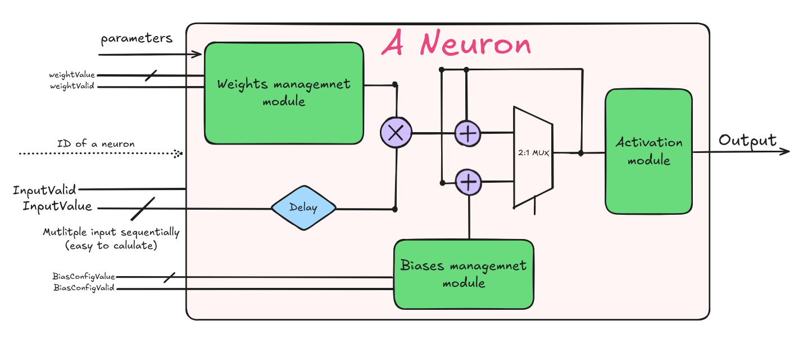

# Neural Network FPGA Implementation

## Overview

This project implements a hardware-accelerated neural network on FPGA. The design features pipelined processing units with configurable parameters for efficient inference in hardware.

## Architecture

The implementation uses a modular approach with these key components:

- **Neuron Module**: The fundamental processing unit
- **Layer Modules**: Collections of neurons processing data in parallel
- **Weight Memory**: Parameterized storage for weights
- **Activation Functions**: Configurable ReLU and Sigmoid implementations
- **MaxFinder**: Determines the highest confidence output class

## Neuron Implementation

The `neuron` module is the core building block of the neural network. Each neuron:

1. Loads weights from memory (pre-trained or runtime configured)
2. Performs multiply-accumulate operations
3. Adds bias value
4. Applies activation function
5. Outputs result when processing is complete

### Dataflow Pipeline

The neuron implements a multi-stage pipeline:
- **Stage 1**: Input buffering and weight fetching
- **Stage 2**: Multiplication of input with weight
- **Stage 3**: Accumulation with saturation protection
- **Stage 4**: Bias addition
- **Stage 5**: Activation function (ReLU/Sigmoid)

### Fixed-Point Arithmetic

All calculations use fixed-point arithmetic with:
- Configurable data width (default: 16 bits)
- Configurable integer portion width
- Overflow protection through saturation logic
- Proper signed operations

## Activation Functions

Two activation functions are supported:

1. **ReLU**: Implemented in the `ReLU.v` module
   - Passes through positive values
   - Zeros out negative values
   - Handles overflow with saturation

2. **Sigmoid**: Implemented in the `sigmoid.v` module
   - Uses lookup table approach for efficiency
   - Memory-mapped implementation with proper signed value handling

## Configuration Options
The design supports both:
- **Pre-trained mode**: Weights and biases loaded from MIF files
- **Runtime configuration**: Weights and biases loaded through external interface

## Usage
-!ToDo()

## Some optimisation that can be done
- convert sequential input to parallel input
  - need to make specific neuron for each layer
- optimise NN_main